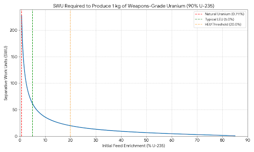
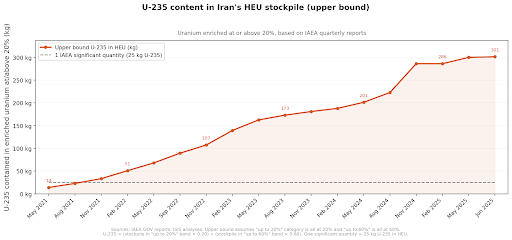
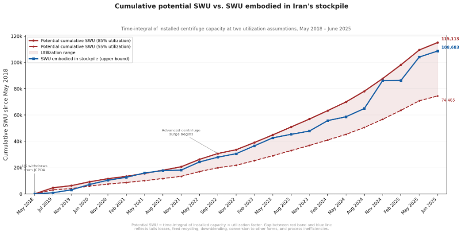
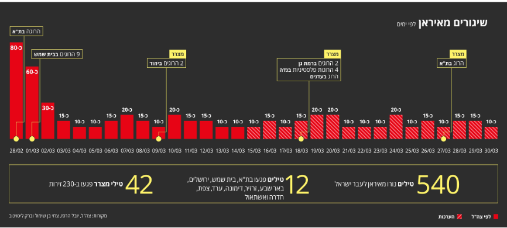
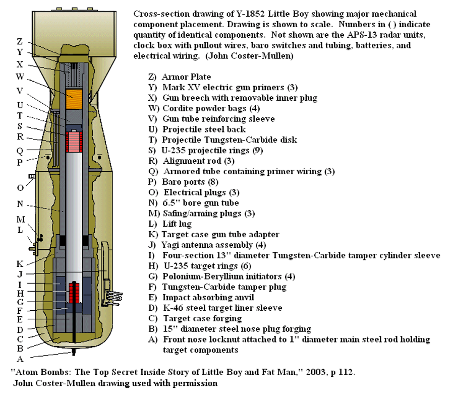

# What the FUCK is wrong with Iranian Nuclear Program??? Part 1–It’s easy(but not that easy) to make a nuke

把大象放进冰箱需要几步？答：三步，只要你的冰箱够大。那让现在的伊朗拥有核打击能力要几步？只要你有合适的知识、设备和人力，答案是五步：把铀转化成UF6然后浓缩，把浓缩后的UF6转化成UF4，把UF4转化成武器级金属铀，设计制造核弹，最后把核弹装进对准特拉维夫的弹道导弹里。

## 第一步：浓缩铀

因为需要在巨大的设施里部署几千台巨大的离心机，我们一般认为浓缩铀的制造是核武器制作中最好监控、最容易限制的一步。因此，我们对伊朗的浓缩铀存量有着最为详细的了解（见fig2）。

在2025年午夜重锤行动对伊朗铀浓缩设施打击前，伊朗大约拥有400kg的60%浓缩铀。对于60%浓缩铀，这里最容易出现的就是第一个误区：核原料的浓缩难度并非随初始浓度线性下降，而是呈反比例下降（见fig1）；从天然铀（0.711%）浓缩1颗核弹所需的25kg武器级铀大约需要6000SWU，而从100倍于天然铀的60%浓缩铀出发只需要大约百分之一的100SWU。如果拿从上海到北京的旅程作比，60%给人的印象应该是还在济南，但实际计算告诉我们它相当于已经上了五环——只差最后一步了。

如果以伊朗最新型的IR-6离心机估算，大概只需要伊朗浓缩能力的2%——或者说200台隐秘设施里的离心机工作一个月就能产出1发核弹所需的材料。尽管午夜重锤行动摧毁或者瘫痪了Fordow和Natanz设施和伊朗的大部分离心机，但伊斯法罕设施新建的地下离心设施并未被摧毁：尽管伊朗在伊斯法罕剩余的浓缩能力未知，但有相当大的可能性是大于2%的；这意味着无论战争和打击是否继续，伊朗都有相当可能完成武器级核材料的浓缩。

fig.1：分离一公斤武器级浓缩铀需要的SWU，呈反比例下降趋势。

fig.2：伊朗的高浓缩铀在2021年Q3第一次超过1倍临界质量，至IAEA最后一次报告的2025Q2已经达到约12倍临界质量，其中60%浓缩铀超400kg。

fig.3：伊朗的公开离心能力和IAEA报告的伊朗浓缩铀存量上界基本符合。任何非公开的离心能力都可能意味着未公开的浓缩铀。

## 第二步：生产绿盐（UF4）
在核武器生产流程中常常被忽视的是将UF6转化为核弹所需的铀金属的化学、物理过程。由于我化学知识的致命不足，以下内容来自AI：

在核燃料循环中，UF6气体必须首先转化为四氟化铀UF4，然后才能被还原为金属铀。标准工艺通常采用氢还原法：在500–600°C的加热反应容器中，使 UF6与氢气发生反应，生成 UF4 粉末，并产生剧毒且强腐蚀性的氢氟酸作为副产品。
该反应的化学原理已非常明确，所需设备也并不罕见——主要是配备了复杂气体处理系统的加热式Inconel或者Monel合金反应容器。这里面的主要技术挑战是管理高腐蚀性的HF副产品：由于氢氟酸极强的腐蚀性，普通不锈钢在高温下会被迅速破坏，因此处理UF6的核设施必须采用昂贵的特种耐腐蚀合金。然而，这些设备在现代化学工业中是完全合法且必需的。
结合伊朗的国民经济与工业体系特点，在上述具备此类特种设备的民用工厂中，伊朗最可能（且已经）拥有的是以下几类：
大型石油炼化厂（极高可能性 / 核心优势）： 伊朗是全球主要的油气生产国，拥有庞大的重石化工业（如阿巴丹炼油厂等）。现代炼油厂中通常配备“氢氟酸（HF）烷基化”装置，用于生产高辛烷值汽油添加剂。这意味着伊朗的石化行业对大规模处理液态和气态HF有着极其丰富的工程经验，必然储备了大量针对HF腐蚀定制的蒙乃尔合金泵、阀门、特种管线以及泄漏控制系统。这是其最坚实的军民两用工业基础。
基础氟化工与农药/制药中间体工厂（高可能性）： 为了满足国内庞大的农业和医疗需求，并在长期制裁下实现自给自足，伊朗建立了一定规模的精细化工和制药工业。生产含氟药物或农药、聚四氟乙烯（特氟龙）以及制冷剂的工厂，每天都需要处理无水氢氟酸（AHF）。这些工厂中广泛分布着中小型耐腐蚀特种合金反应釜和废气洗涤塔，其工艺环境与铀转化车间高度相似。
特种金属冶炼厂（中高可能性）： 伊朗拥有丰富的矿产资源和成熟的冶金工业（包括铜、钢以及部分稀有金属）。在某些卤化物还原法提炼特种金属（如钛、锆）的过程中，同样涉及高温气体还原和强腐蚀性环境，需要使用耐高温腐蚀的反应器。
如上所述，尽管伊斯法罕的铀燃料转化设施UCF已经在2025年6月被摧毁，伊朗依然有足够的民用工业设备完成这个步骤。这一步的场地更加脆弱，开始制造后被美以打击的风险也更大，但一旦美以停止打击（TACO），伊朗就有能力在较短的时间内完成这个步骤。

## 第三步：铀金属生产和加工
接下来需要将UF4转化成金属铀并制成核弹需要的几何形状；以下内容依然来自AI：
四氟化铀（UF4，即“绿盐”）通常通过金属热还原（也称“热弹还原”）工艺转化为金属铀。具体过程是将UF4粉末与镁或钙颗粒混合，装入内衬耐火材料（通常为氟化钙或氟化镁）的钢制坩埚中。将炉料密封并点火后，剧烈的放热反应会生成熔融状态的金属铀，以及由氟化镁或氟化钙组成的炉渣。熔融金属会沉积在容器底部，凝固后形成一种被称为“铀锭”的粗制金属块。
随后，必须将这些铀锭放入真空感应炉（VIF）中重新熔化，并铸造成特定的几何形状——例如内爆式设计所需的半球或环状，或是枪式设计所需的圆柱体或圆环。金属铀具有自燃性和毒性，且冶金特性十分复杂（它拥有三种同素异形体；在668°C时发生的α相到β相的晶型转变会大幅增加铸造难度）。为了防止氧化，所有的加工环节都必须在真空或惰性气体环境中进行。此外，后续的机械加工必须使用硬质合金刀具，并对切屑进行极其严格的安全管控。
将金属铀还原并加工成型，所需的技术虽然特殊，但几乎都能在伊朗现有的高端民用和常规军工体系中找到完美对应。最可能被“军民两用”的能力可以精简为以下三项：
1. 航空航天制造（提供“真空熔炼”能力） 重新熔化和铸造铀金属必须使用真空感应炉（VIF）。为了自主制造导弹部件、无人机和喷气式发动机的耐高温合金，伊朗已经储备了相当规模的真空熔炼与精密铸造设备。
2. 特种金属提炼（提供“热还原”经验） 用镁把“绿盐”还原成金属块的工艺，与常规工业中提炼海绵钛或锆的技术（克罗尔法）极为相似。伊朗拥有较为发达的特种冶金工业，已经熟练掌握了处理这类高温、剧烈放热反应，也保有着许多特种耐火坩埚。
3. 常规防务机加工（提供“危险金属加工”体系） 铀金属有毒且切屑极易自燃。但是，伊朗在生产轻量化航空器部件时，可能早已习惯了在惰性气体保护下，使用硬质合金刀具去加工同样易燃、危险的镁合金或钛合金，具备成熟的安全回收和防爆加工经验。
核心结论： 本质上，只要一个国家具备了制造现代航空发动机和先进导弹的冶金与精密机加工能力，它在硬件上就已经完全具备了制造金属铀核心部件的基础。
与上一步类似，尽管在当前战争环境下完成这一步需要相当难度，但一旦美国选择TACO，伊朗就能在民用工业的基础上（甚至是废墟里）速通这个步骤。

## 第四步：核弹零部件设计和制造
可能有人会认为，有着美以孜孜不倦对伊朗核科学家的斩首，伊朗就算拿到了材料也造不出核弹；但不涉及聚变的核弹原理十分简单，几种主要的构型原理也早就被研究的彻彻底底了。虽然使用最为广泛的内爆式核弹需要对炸弹透镜进行精密的设计和测试，但更加原始的枪式核弹只需要极少的几个零部件就能发挥实战作用。在1960年代的第N国实验里，两个大学生在仅仅3年的时间里就完成了核武器的构型和原理设计；而在知识更易得、可以用vibe coding+开源库模拟（Open MC）的现在，对一个枪式核弹的计算和模拟恐怕只需要几个工程和计算机背景的大学生用AI写代码花几天的时间就能完成，如果开实习证明的话靠自备token的大学生大概需要花费0元。
枪式核弹的其他零部件更是无比简单：小男孩使用的6.5英寸炮管只是一根普通的钢管，炸药则是当时海军常用的线状无烟火药；控制起爆逻辑放在现在则只需要一部单片机加上一个iPhone里都能找到的气压计。事实上，这一步是核能力构筑所有步骤里最最简单的，也是五个步骤里伊朗唯一100%能在任何时候完成的。

## 第五步：核打击载具
尽管美以对伊朗的弹道导弹展开了全方位的、卓有成效的猎杀，但伊朗的弹道导弹似乎依然没有彻底耗尽的迹象（见Fig4）。对于有一定悬念的核武器小型化，“第一代核武器需要四五吨”实际上是小男孩设计极度缺乏经验给我们带来的错觉。例如，小男孩使用了密度巨大的碳化钨中子反射层（Fig5-I），后续经验表明可以删除，或者也可以换成轻得多的铍中子反射层；再比如由于当时对核材料几何形状，设计的知识不足，小男孩上的“子弹”（Fig5-S）占了核材料质量的60%，而“标靶”（Fig5-H）只占了40%，在更先进的设计下——比如W88——“子弹”的质量小得多，需要的炮管和火药也就轻得多了。即便以美国1950年Mark 8核弹的1200kg作为伊朗核弹的技术下限，这也是一个伊朗许多重型导弹能够达成的投送重量。这意味着小型化和到特拉维夫的投送手段对伊朗从来不是一个难题。

Fig.4 伊朗对以色列发射的弹道导弹逐日估计；即便是3月底依然保持着每日10-15发的攻击频率

Fig.5 小男孩的大致设计

## 总结
对伊朗来说，在2025年6月“午夜重锤”前，制作核武器是很简单的事情。从2026年4月现在看，尽管因为持续的美以空袭，受重视程度没那么高的、将UF6加工成金属铀部件的化学物理过程成了潜在的卡脖子步骤，但其他步骤都能在即便是美以持续轰炸的当下跑通。一旦美国因为政治意志不足选择TACO并与伊朗谈和，这个脆弱的、仅有的限制也能在至多几个月内通过民用设施被打破。

那么，伊朗为什么没有能够在2025年6月前试爆一枚核弹？在当前的局势升级程度下事情将如何进展？请看本系列后续部分。
